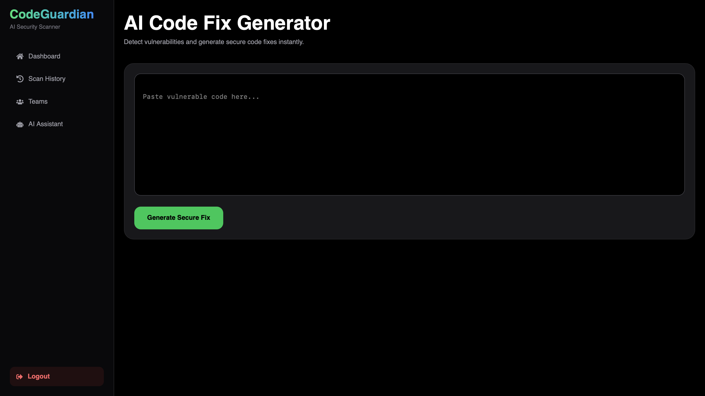
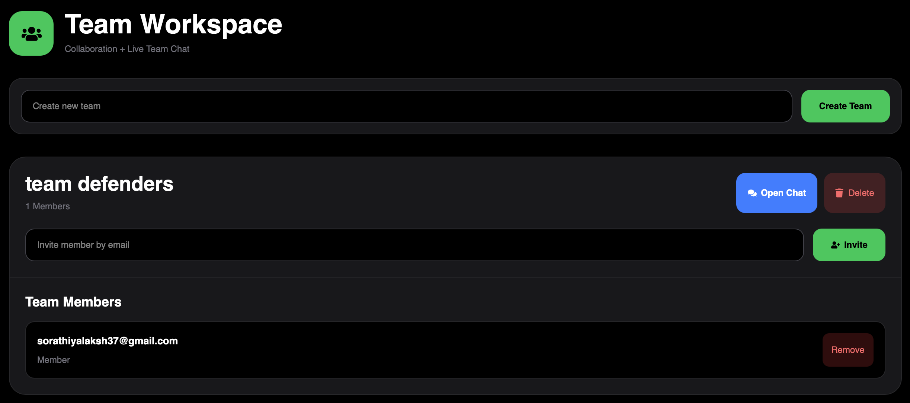
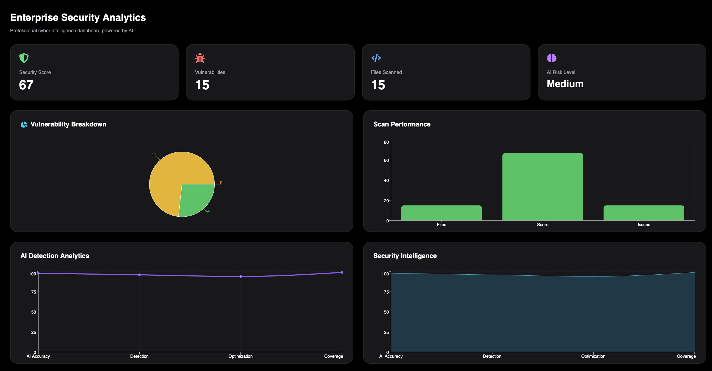
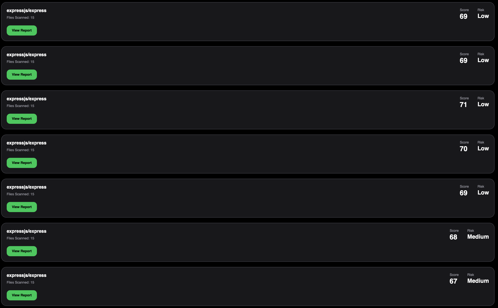
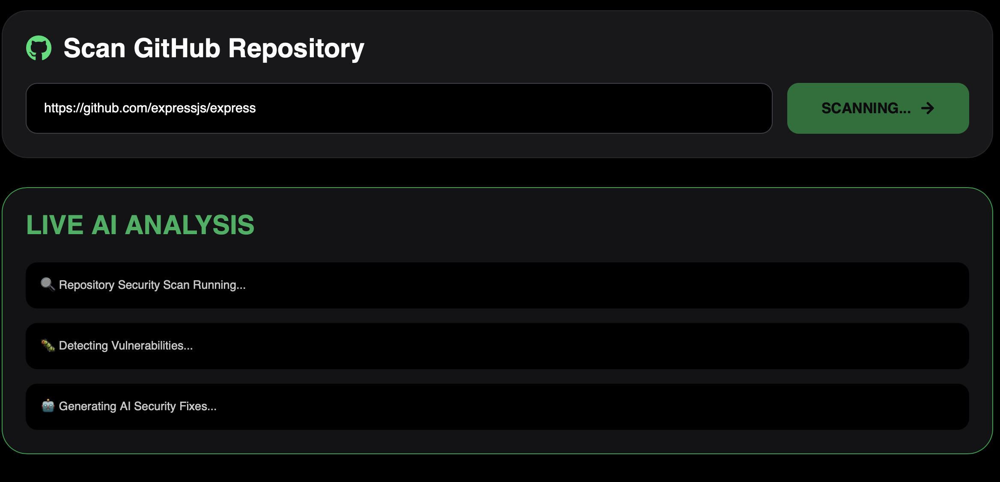

<div align="center">
  
  <h1>🛡️ CodeGuardian AI</h1>
  <p><strong>AI-Powered Security Scanner for GitHub Repositories with Real-time Team Collaboration</strong></p>
  
  <p>
    
    
    
    
    
    
  </p>
  
  <p>
    
    
    
    
  </p>
</div>

---

## 📌 Table of Contents

- [🌟 Overview](#-overview)
- [✨ Features](#-features)
- [🏗️ Architecture](#️-architecture)
- [🚀 Demo](#-demo)
- [📸 Screenshots](#-screenshots)
- [🛠️ Tech Stack](#️-tech-stack)
- [⚡ Quick Start](#-quick-start)
- [📁 Project Structure](#-project-structure)
- [🔧 Environment Variables](#-environment-variables)
- [📡 API Endpoints](#-api-endpoints)
- [🚢 Deployment](#-deployment)
- [🤝 Contributing](#-contributing)
- [📝 License](#-license)
- [👨‍💻 Contact](#-contact)

---

## 🌟 Overview

**CodeGuardian AI** is a comprehensive security scanning platform that leverages artificial intelligence to detect vulnerabilities in code repositories. It provides real-time team collaboration, automated security reports, and an intelligent AI assistant to help developers write secure code.

### 🎯 Problem It Solves

- ❌ Manual code reviews are time-consuming and error-prone
- ❌ Security vulnerabilities often go unnoticed until production
- ❌ Teams lack real-time collaboration for security fixes
- ❌ Junior developers struggle to understand complex security issues

### ✅ Our Solution

- ✅ AI-powered vulnerability detection in seconds
- ✅ Real-time team chat for collaborative security fixes
- ✅ Automated PDF reports for compliance
- ✅ AI assistant that explains vulnerabilities in plain English

---

## ✨ Features

### 🔐 Authentication & Security
- JWT-based authentication with refresh tokens
- GitHub OAuth integration for seamless login
- Secure password hashing with bcrypt
- Protected routes and API endpoints

### 📊 Repository Scanning
- Scan any public GitHub repository
- AI-powered vulnerability detection using Groq LLM
- Severity classification (Critical, High, Medium, Low)
- Code quality and performance analysis
- Automatic fix suggestions

### 👥 Team Collaboration
- Create and manage multiple teams
- Invite members via email
- Real-time team chat with Socket.io
- Online/offline status indicators
- Typing indicators and read receipts

### 🤖 AI Features
- **AI Security Assistant**: Ask security-related questions
- **Code Fixer**: Automatic vulnerability fixes with explanations
- **Security Recommendations**: Best practices tailored to your code

### 📄 Reports & Analytics
- Detailed vulnerability reports per file
- PDF report generation for compliance
- Scan history tracking
- Interactive analytics dashboard with charts
- Severity breakdown visualization

### 🎨 User Interface
- Modern dark theme design
- Fully responsive (Mobile, Tablet, Desktop)
- Real-time progress indicators
- Toast notifications for events

---


---

## 📸 Screenshots

<div align="center">
  <h3>Login Page</h3>
  
  
  <h3>Dashboard</h3>
  
  
  <h3>Repository Scan Results</h3>
  
  
  <h3>Team Chat</h3>
  
  
  <h3>AI Assistant</h3>
  
  
  <h3>Analytics Dashboard</h3>
  
  
  <h3>PDF Report</h3>
  
</div>

---

## 🛠️ Tech Stack

### Frontend
| Technology | Purpose |
|------------|---------|
| **React 18** | UI library with hooks |
| **React Router DOM** | Client-side routing |
| **Tailwind CSS** | Utility-first styling |
| **Socket.io-client** | Real-time communication |
| **Axios** | HTTP requests |
| **Recharts** | Interactive charts |
| **React Hot Toast** | Toast notifications |
| **React Icons** | Icon library |
| **jsPDF** | PDF generation |

### Backend
| Technology | Purpose |
|------------|---------|
| **Node.js** | JavaScript runtime |
| **Express.js** | Web framework |
| **MongoDB** | NoSQL database |
| **Mongoose** | ODM for MongoDB |
| **Socket.io** | WebSocket server |
| **JWT** | Authentication |
| **bcryptjs** | Password hashing |
| **Passport.js** | GitHub OAuth |
| **Axios** | External API calls |

### AI Integration
| Service | Purpose |
|---------|---------|
| **Groq API** | LLM for code analysis |
| **GitHub API** | Repository access |

### DevOps & Deployment
| Service | Purpose |
|---------|---------|
| **Vercel** | Frontend hosting |
| **Render** | Backend hosting |
| **MongoDB Atlas** | Cloud database |
| **GitHub Actions** | CI/CD |

---

## ⚡ Quick Start

### Prerequisites

- Node.js (v18 or higher)
- MongoDB (local or Atlas)
- GitHub OAuth App credentials
- Git

### Installation

1. **Clone the repository**
```bash
git clone https://github.com/sorathiyalaksh37-lang/CODEGUARDIAN-AI.git
cd CODEGUARDIAN-AI